# Diagramas del portafolio

Diagramas visuales de **cómo funciona cada proyecto**, pensados para entenderlos de un vistazo. Complemento del documento [RESUMEN-PROYECTOS.md](RESUMEN-PROYECTOS.md).

> **Cómo verlos:** GitHub renderiza estos diagramas (Mermaid) automáticamente. En VS Code necesitas la extensión *"Markdown Preview Mermaid Support"*.

## Leyenda de colores

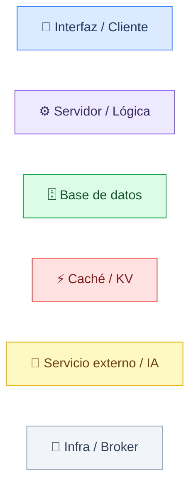

## Vista de conjunto

Dónde vive cada proyecto y de qué motor de datos o servicio depende.

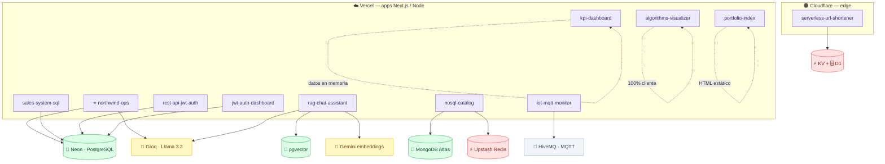

---

## 1. ⭐ northwind-ops

**La historia:** un usuario registra una venta y el sistema, en una sola transacción "todo o nada", reserva el stock, crea el pedido y anota el evento. Si no hay stock, nada se guarda.

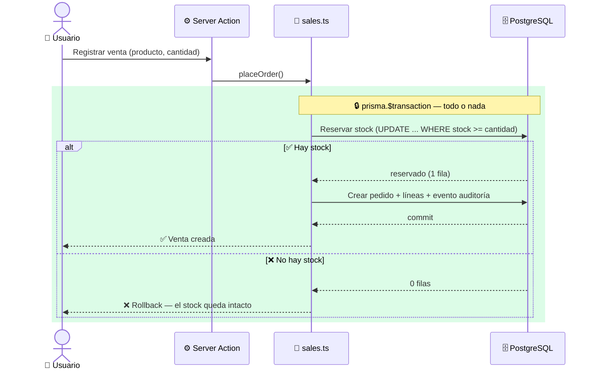

**El resto de la plataforma** (dashboard, tiempo real y asistente):

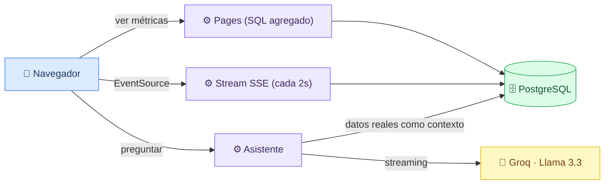

---

## 2. rag-chat-assistant

**La historia:** la pregunta se convierte en números (vector), se buscan los fragmentos más parecidos de la documentación, y el modelo responde **solo** con eso. Si no encuentra nada relevante, se niega a inventar.

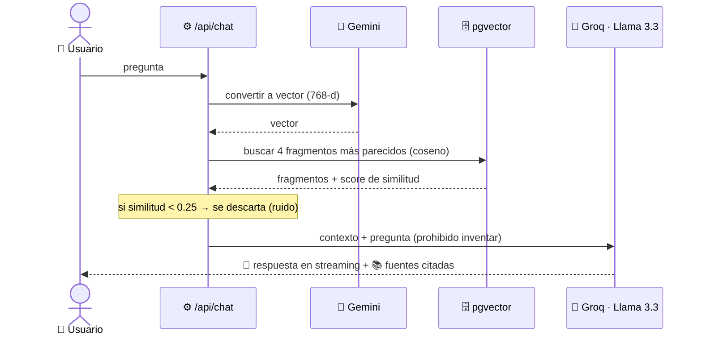

**Ingesta (una sola vez, offline):** los documentos se trocean, se convierten en vectores y se guardan.

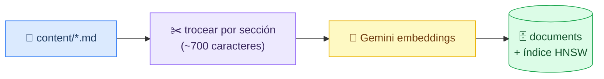

---

## 3. nosql-catalog

**La historia:** la primera consulta va a MongoDB (lenta) y se guarda una copia en Redis; las siguientes salen del caché (rapidísimas) hasta que la copia caduca a los 60 segundos.

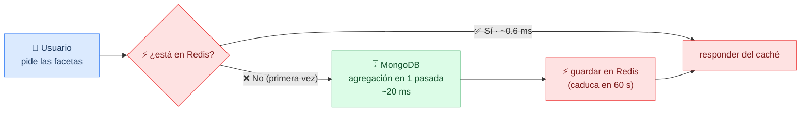

---

## 4. sales-system-sql

**La historia:** cada tabla de la página "SQL Insights" viene de una consulta SQL real (con CTEs y funciones de ventana), y la propia página te muestra el SQL exacto que la produjo.

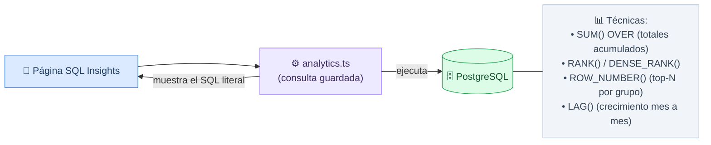

---

## 5. serverless-url-shortener

**La historia:** al visitar un enlace corto, el Worker responde con la redirección **al instante** (leyendo de KV) y guarda la estadística del clic **después**, sin hacer esperar al visitante.

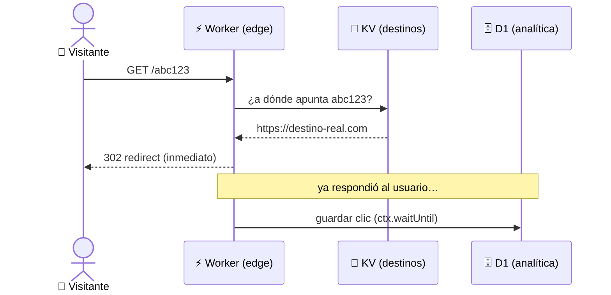

**Al crear un enlace** se valida el destino (anti-phishing/SSRF) y se limita el ritmo por IP:

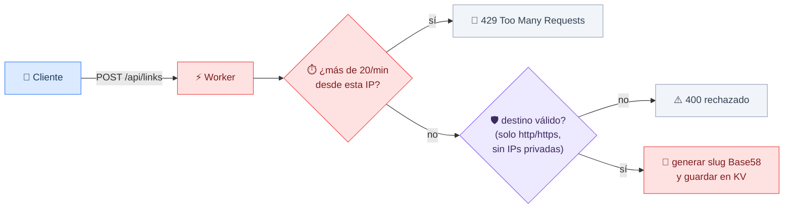

---

## 6. rest-api-jwt-auth

**La historia:** cada petición pasa por capas limpias (ruta → controlador → servicio). Y al renovar la sesión, el token viejo se borra y se emite uno nuevo (rotación real, no solo "sigue válido").

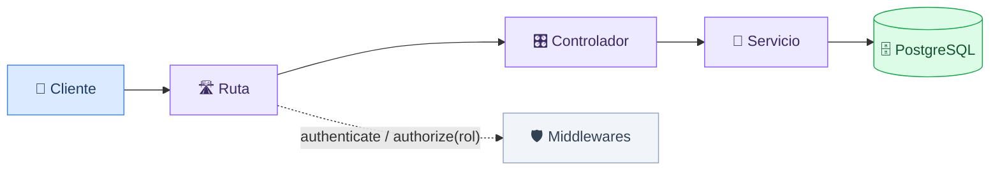

**Rotación de refresh token** (lo que hace que el logout sea real):

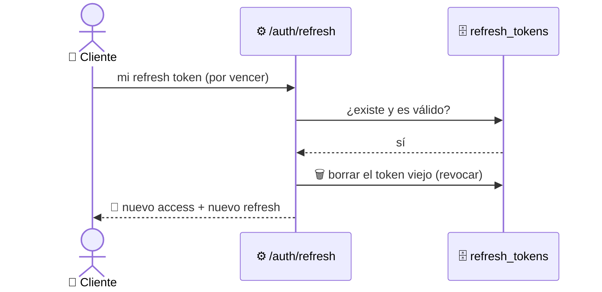

---

## 7. jwt-auth-dashboard

**La historia:** al hacer login, el servidor guarda los tokens en cookies que el JavaScript del navegador no puede leer (httpOnly). Las páginas protegidas verifican esa cookie antes de mostrar nada.

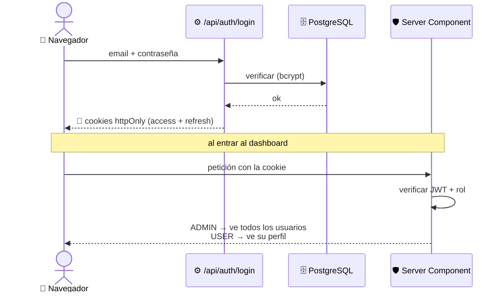

---

## 8. iot-mqtt-monitor

**La historia:** las máquinas (o el simulador) **publican** telemetría a un broker; el dashboard del navegador está **suscrito** y la recibe en vivo. Ninguno conoce al otro: solo comparten el broker.

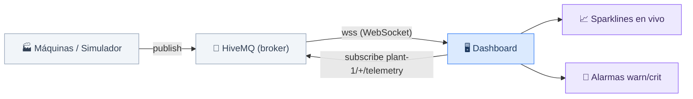

---

## 9. kpi-dashboard

**La historia:** un generador determinista fabrica 24 meses de pedidos (siempre los mismos), se agregan como lo haría SQL, y se dibujan con gráficos SVG hechos a mano.

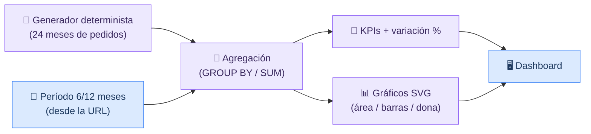

---

## 10. algorithms-visualizer

**La historia (la idea clave):** cada algoritmo de ordenamiento es un *generador* que va "narrando" sus operaciones. Ese mismo código alimenta a la vez la **animación** y el **contador** que dibuja la curva de Big O — no hay dos versiones que se contradigan.

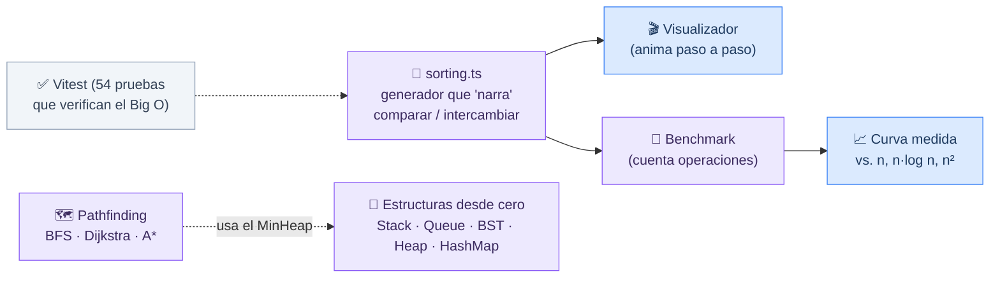

---

## 11. portfolio-index

**La historia:** una sola página HTML, sin build. Un array de proyectos en JavaScript se dibuja como tarjetas, con filtros, idioma y tema — todo en el navegador.

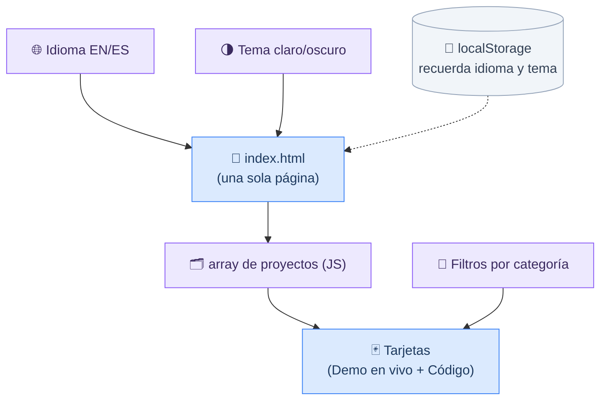
