# Portafolio de proyectos — Resumen técnico

> **Autor:** Jerson Villamizar · GitHub [@jersonvillamizar214](https://github.com/jersonvillamizar214)
> **11 proyectos** en producción, todos gratuitos (capa free de Vercel, Cloudflare, Neon, MongoDB Atlas, Upstash), con CI en GitHub Actions y toggle de **tema claro/oscuro + idioma EN/ES** (inglés + claro por defecto).

Este documento explica, proyecto por proyecto, **qué es, con qué tecnologías está hecho, cómo funciona por dentro y qué conceptos demuestra**. Está basado en el código real de cada repo, no en descripciones genéricas.

> 📊 **¿Prefieres verlo en diagramas?** Hay una versión visual e intuitiva (con iconos y colores) en [DIAGRAMAS.md](DIAGRAMAS.md).

---

## Índice y mapa rápido

| # | Proyecto | En una frase | Stack principal | Demo en vivo |
|---|----------|--------------|-----------------|--------------|
| 1 | **northwind-ops** ⭐ | Plataforma de operaciones full-stack (capstone) | Next.js · PostgreSQL/Prisma · ACID · SSE · Groq | [live](https://northwind-ops-javf.vercel.app) |
| 2 | **rag-chat-assistant** | Chat empresarial con RAG real (sin alucinaciones) | Next.js · pgvector · Gemini embeddings · Groq/Llama 3.3 | [live](https://rag-chat-assistant-javf.vercel.app) |
| 3 | **nosql-catalog** | Catálogo NoSQL con caché medible | Next.js · MongoDB · Redis | [live](https://nosql-catalog-javf.vercel.app) |
| 4 | **sales-system-sql** | Analítica en SQL crudo (CTEs, window functions) | Next.js · PostgreSQL/Prisma | [live](https://sales-system-sql-javf.vercel.app) |
| 5 | **serverless-url-shortener** | Acortador de URLs en el edge | Cloudflare Workers · KV · D1 · Hono | [live](https://serverless-url-shortener.jersonvillamizar214.workers.dev) |
| 6 | **rest-api-jwt-auth** | API REST con JWT + rotación de tokens | Node · Express · Prisma · PostgreSQL | [live](https://rest-api-jwt-auth-javf.vercel.app) |
| 7 | **jwt-auth-dashboard** | Auth full-stack (la misma auth, en Next.js) | Next.js · Prisma · JWT · cookies httpOnly | [live](https://jwt-auth-dashboard-javf.vercel.app) |
| 8 | **iot-mqtt-monitor** | Telemetría industrial en tiempo real | Next.js · MQTT.js · HiveMQ · WebSockets | [live](https://iot-mqtt-monitor-javf.vercel.app) |
| 9 | **kpi-dashboard** | Dashboard de BI con charts SVG a mano | Next.js · datos deterministas | [live](https://kpi-dashboard-javf.vercel.app) |
| 10 | **algorithms-visualizer** | Estructuras de datos y Big O medido | Next.js · Vitest · generadores | [live](https://algorithms-visualizer-javf.vercel.app) |
| 11 | **portfolio-index** | Landing que reúne todo el portafolio | HTML/CSS/JS vanilla | [live](https://portfolio-index-javf.vercel.app) |

**Base común de los proyectos Next.js:** Next.js 16 (App Router) · React 19 · TypeScript 5 · Tailwind CSS v4 · ESLint 9 · Dockerfile · CI en GitHub Actions · sistema propio de tema/idioma (`src/components/ui.tsx` con contexto `useUi` + `src/lib/i18n.ts` con el objeto `T`).

**Vista de conjunto (dónde vive cada proyecto y qué motor de datos usa):**

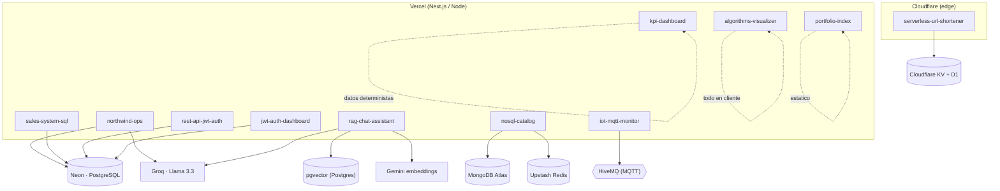

---

## 1. northwind-ops ⭐ (capstone)

**Qué es.** La pieza integradora del portafolio: una sola app Next.js que reúne dashboard de KPIs, CRUD de inventario, ventas transaccionales, feed de actividad en tiempo real y un asistente de IA. Modela la operación de un negocio tipo Northwind y demuestra que **una venta nunca puede sobrevender stock**, aun con pedidos concurrentes.

**Stack.** Next.js 16 (App Router + **Server Actions**) · React 19 · TypeScript · **PostgreSQL con Prisma** · **Groq** (`groq-sdk`, modelo `llama-3.3-70b-versatile`) · Tailwind v4 · Docker (Postgres local en :5435) · **Vercel + Neon** en producción.

**Cómo funciona por dentro / conceptos que demuestra.**
- **Transacción ACID atómica con reserva condicional** (`src/lib/sales.ts` → `placeOrder`): dentro de un solo `prisma.$transaction`, el stock se reserva con `updateMany({ where: { id, stock: { gte: quantity } }, data: { stock: { decrement } } })`. Si `count === 0`, lanza error y hace **rollback** completo. Al ser un único statement condicional (no read-then-write), dos ventas simultáneas nunca sobrevenden. En la misma transacción crea el `Order`, sus `OrderItem` y un `Event` de auditoría.
- **Separación negocio/framework:** `sales.ts` no importa nada de Next.js, así que el CI ejercita exactamente las mismas funciones que la UI. `src/lib/actions.ts` es la capa fina `"use server"` que parsea `FormData`, llama a `sales.ts` y hace `revalidatePath`.
- **SQL agregado avanzado** (`src/lib/metrics.ts`, con `prisma.$queryRaw`): KPIs de ventana 30d vs. 30d previos con `SUM(...) FILTER (WHERE ...)`; serie de 6 meses con `generate_series` + `date_trunc` (gap-filled); ingresos por categoría con múltiples JOINs.
- **Server-Sent Events (SSE)** (`src/app/api/events/stream/route.ts`): un `ReadableStream` que hace polling cada 2 s, emite `id:/data:`, manda keep-alives, se cierra a los 50 s (el navegador reconecta) y respeta `req.signal` abort. Cliente `LiveFeed.tsx` con `EventSource`, indicador "live" y deduplicación por `id`.
- **Asistente IA "grounded":** antes de llamar a Groq inyecta KPIs/ingresos/stock reales como contexto y el system prompt prohíbe inventar cifras; responde en **streaming** token a token.
- **Integridad referencial:** un producto con ventas se **descontinúa** (`active=false`) en vez de borrarse; solo se eliminan los nunca vendidos.

**Características.** Dashboard con KPIs + deltas + charts SVG (`RevenueChart`, `CategoryBars`) · inventario con edición inline de stock · ventas ACID · feed SSE en vivo · asistente Llama 3.3 · i18n · seed de 15 productos / 60 clientes / 400 pedidos.

**Archivos clave.** `src/lib/sales.ts` (ACID), `src/lib/actions.ts` (`"use server"`), `src/lib/metrics.ts` (SQL), `src/app/api/events/stream/route.ts` (SSE), `src/app/api/assistant/route.ts` (Groq), `prisma/schema.prisma` (tablas `products`, `orders`, `order_items`, `events`…).

**Diagrama.**

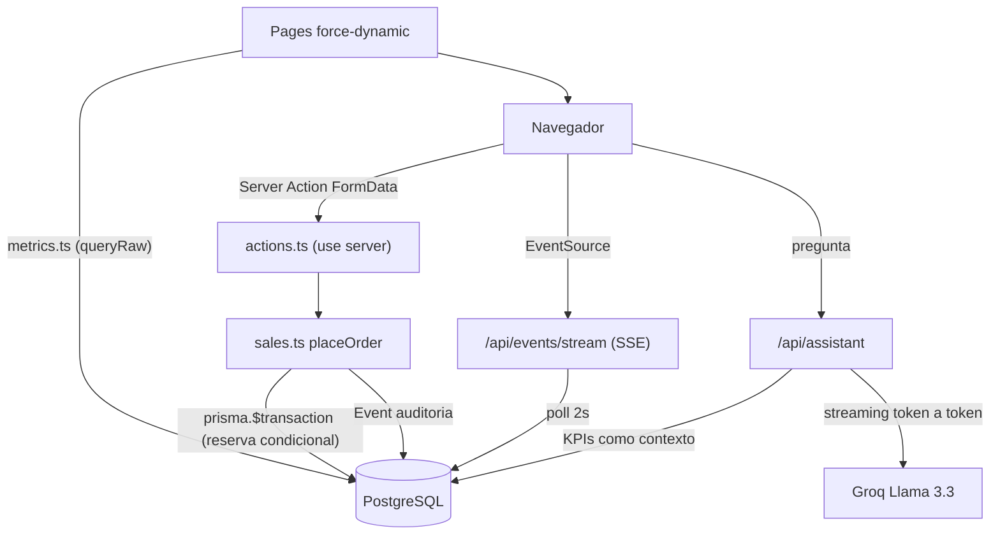

---

## 2. rag-chat-assistant

**Qué es.** Un asistente que responde **únicamente** con la documentación propia de la empresa (retailer ficticio "Northwind"): búsqueda semántica real, respuesta fundamentada en los pasajes recuperados, fuentes citadas con su score de similitud, y **se niega a responder** cuando el dato no está. Es RAG de verdad, no un chatbot con prompt.

**Stack.** Next.js 16 · React 19 · TypeScript · **Embeddings Google `gemini-embedding-001` (768-d)** · **PostgreSQL + pgvector** (índice **HNSW**, `vector_cosine_ops`, cliente `pg`) · **LLM Groq · Llama 3.3 70B** (`groq-sdk`, streaming) · **Vercel + Neon**.

**Cómo funciona por dentro (pipeline RAG de 3 pasos, `src/app/api/chat/route.ts`).**
- **1. RETRIEVE** (`src/lib/retrieve.ts`): embebe la pregunta y hace `ORDER BY embedding <=> $1::vector LIMIT k` en la tabla `documents`, devolviendo `1 - (embedding <=> query) AS similarity` (coseno). Filtra por umbral `MIN_SIMILARITY = 0.25` y toma top-4.
- **2. AUGMENT:** inyecta los chunks recuperados como bloque `CONTEXTO` etiquetado por fuente.
- **3. GENERATE:** Groq/Llama 3.3 con `temperature 0.2`, `max_tokens 500`, `stream: true`. El system prompt impone grounding estricto: si no está en el contexto, responde exactamente *"No tengo esa información en la documentación de Northwind."*
- **Streaming + fuentes:** la respuesta se emite como `ReadableStream` de texto; las fuentes (similarity + snippet) viajan en un header `X-Sources` en base64 (para preservar acentos).
- **Embeddings asimétricos:** distinto `taskType` para documentos (`RETRIEVAL_DOCUMENT`) vs. preguntas (`RETRIEVAL_QUERY`), con **L2-normalización** para que el coseno equivalga a producto punto.
- **Ingesta** (`scripts/ingest.ts`): `CREATE EXTENSION vector`, tabla `documents(... embedding VECTOR(768))` + índice HNSW; chunkea los `.md` por sección `##` (~700 chars, overlap 120) → 25 chunks.

**Características.** Búsqueda semántica multilingüe · cero alucinaciones · fuentes con score visible · streaming · base de conocimiento editable (deja `.md` en `content/` y re-ingesta) · verificación de comportamiento en CI.

**Archivos clave.** `src/app/api/chat/route.ts`, `src/lib/retrieve.ts`, `src/lib/embeddings.ts`, `src/lib/db.ts`, `scripts/ingest.ts`, `content/*.md`.

**Diagrama.**

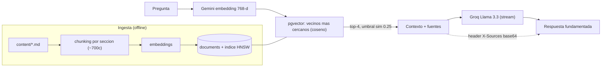

---

## 3. nosql-catalog

**Qué es.** Un catálogo de 5.000 productos hecho para responder de forma **medible** a "¿cuándo usarías NoSQL en vez de SQL?". Cada categoría tiene **un esquema distinto**, las facetas se calculan con el pipeline de agregación de MongoDB, y una caché Redis muestra su speed-up en vivo (MongoDB ~20 ms → Redis ~0.6 ms, decenas de veces más rápido).

**Stack.** Next.js 16 · React 19 · TypeScript · **MongoDB 7** (driver `mongodb`) · **Redis 7** (`ioredis`) · Tailwind v4 · Docker (Mongo :27018, Redis :6380) · deploy pensado para **MongoDB Atlas + Upstash Redis**.

**Cómo funciona por dentro / conceptos que demuestra.**
- **Cache-aside (lazy loading)** (`src/lib/catalog.ts`): mide con `performance.now()`, busca en Redis (`GET`); en miss consulta Mongo y guarda con TTL (`SET ... EX`, `TTL_SECONDS = 60`). Devuelve `{ data, source, ms }` para que la UI muestre origen y latencia.
- **Agregación `$facet`** (`computeFacets`): 4 sub-pipelines en un solo round-trip — categorías (`$group` + `$avg`), marcas (`$group`+`$sort`+`$limit`), rangos de precio (`$bucket`) y total (`$count`) — equivalente a 4 `GROUP BY` en una pasada.
- **Modelo documental justificado:** `attributes: Record<string, string|number|boolean>` — laptops con cpu/ramGb, camisetas con size/fabric, sin migraciones.
- **Features nativas de Redis** (donde Mongo es la herramienta equivocada): contador de vistas atómico con `INCR`; ranking "trending" con sorted set (`ZINCRBY`/`ZREVRANGE`).
- **CI como guardián:** el pipeline **falla si la caché deja de ser más rápida**, y verifica TTL, atomicidad de `INCR` (100 vistas concurrentes = 100 exactas) y el orden del ranking.

**Características.** Facetas en una consulta · benchmark de caché en vivo (`CacheBenchmark.tsx`) · búsqueda por texto (`$text`) · contador de vistas + trending · página `/compare` con criterios SQL vs NoSQL · seed de 5.000 documentos.

**Archivos clave.** `src/lib/catalog.ts`, `src/lib/mongo.ts` y `src/lib/redis.ts` (singletons), `src/app/api/facets/route.ts`, `scripts/seed.ts`, `scripts/verify.ts`.

**Diagrama.**

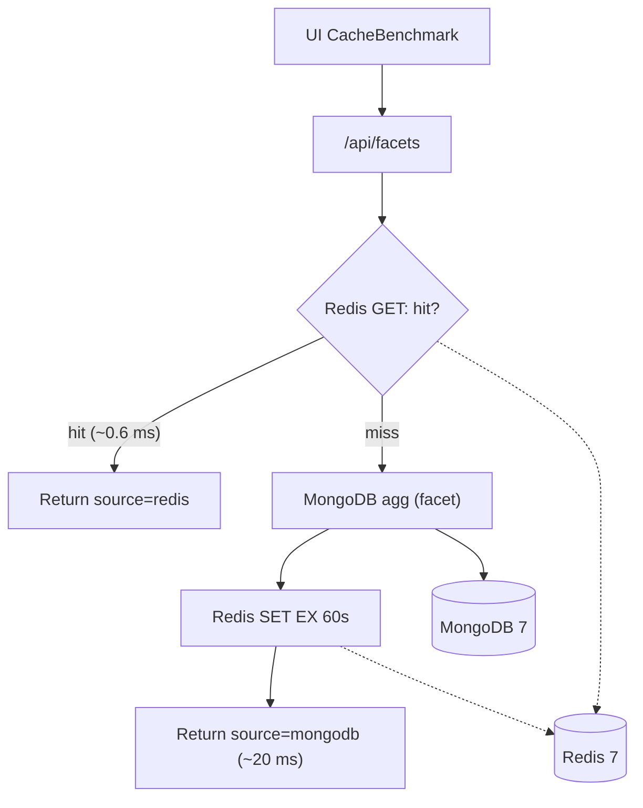

---

## 4. sales-system-sql

**Qué es.** Una app de ventas cuyo verdadero foco es **PostgreSQL avanzado**: esquema normalizado (3NF) con índices y analítica escrita en **SQL crudo** (CTEs, window functions, JOINs múltiples), no solo el ORM. La página "SQL Insights" ejecuta cada consulta en vivo y muestra el SQL exacto que la generó. Es la contraparte "con SQL real" de `kpi-dashboard`.

**Stack.** Next.js 16 · React 19 · TypeScript · **PostgreSQL 16 + Prisma 6** (usa `$queryRawUnsafe` para analítica y el ORM para listados) · Tailwind v4 · Docker (Postgres :5433) · **Vercel + Neon**.

**Cómo funciona por dentro (todo en `src/lib/analytics.ts`; cada `Report` guarda el SQL literal que se ejecuta y se muestra).**
- **Ingresos mensuales:** CTE + running total `SUM() OVER (ORDER BY month)` + crecimiento mes-a-mes con `LAG()` y `NULLIF` (evita división por cero).
- **Productos top:** `RANK() OVER (...)` global + participación por categoría con `SUM() OVER (PARTITION BY categoría)` sobre 3 JOINs.
- **Mejores clientes:** `DENSE_RANK()` + `COUNT(DISTINCT o.id)`.
- **Ingresos por categoría:** window sin partición `SUM() OVER ()` para el % del total.
- **Best-seller por categoría:** el clásico *top-N-por-grupo* con `ROW_NUMBER() OVER (PARTITION BY ... ORDER BY ...)` filtrando `rn = 1`.
- **Modelado:** tabla de unión `OrderItem` que guarda `unitPrice` **histórico** (no un FK vivo a `product.price`); índices estratégicos (`@@index([createdAt])` para rangos temporales, índices en FKs para JOINs).

**Características.** 4 páginas (Resumen/Productos/Pedidos/SQL Insights) · vista colapsable con el SQL exacto de cada reporte · analítica SQL crudo + listados ORM · seed determinista (~2.200 pedidos) · verificación de queries en CI.

**Archivos clave.** `src/lib/analytics.ts` (el corazón), `prisma/schema.prisma` (enum `OrderStatus`), `scripts/verify-queries.ts`, `src/components/InsightsContent.tsx`/`DataTable.tsx`.

**Diagrama.**

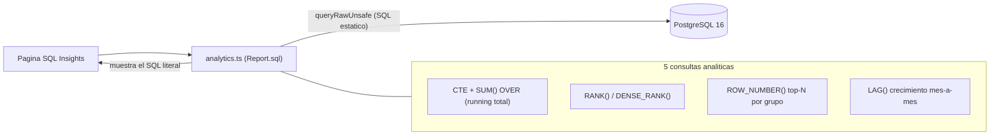

---

## 5. serverless-url-shortener

**Qué es.** Un acortador de URLs que corre íntegramente en el **edge de Cloudflare Workers**: sin servidor caliente, sin contenedor, sin región. La redirección lee de un KV replicado globalmente y la analítica se escribe *después* de responder. Incluye validación de destino para no convertirse en vector de phishing/SSRF.

**Stack.** **Cloudflare Workers** (V8 isolates, `workerd`) · TypeScript · **Hono** (framework HTTP) · **Workers KV** (binding `LINKS`, redirecciones) · **D1** (SQLite serverless, binding `DB`, analítica) · Vitest · Wrangler. Desplegado en `*.workers.dev`. **Sin Docker a propósito** ("no hay contenedor — ese es el punto").

**Cómo funciona por dentro / conceptos que demuestra.**
- **Edge stateless:** no hay memoria entre requests; el estado vive fuera (por eso el rate limiter vive en KV, no en una variable).
- **`ctx.waitUntil()` en el hot path** (`src/index.ts`, `GET /:slug`): lee el destino de KV, responde con `redirect(target, 302)` **primero**, y el `INSERT` del clic en D1 se difiere con `c.executionCtx.waitUntil(...)` — el visitante no espera y la escritura no se pierde al destruirse el isolate.
- **KV con TTL nativo para rate limiting:** contador por IP `rl:${ip}` con `expirationTtl: 60` y límite de 20 creaciones/min → 429. La ventana expira sola, sin cron.
- **Dos almacenes, cada uno en lo suyo:** KV para lookups rápidos (mucha lectura, poca escritura); D1 relacional para analítica con `GROUP BY`/`COUNT`/`LEFT JOIN` y `d1.batch(...)`.
- **Anti-SSRF** (`src/lib/url.ts`): solo `http/https`; bloquea loopback/privadas por regex (incluye `169.254.169.254`, el endpoint de metadata cloud); tope 2048 chars.
- **Slugs seguros** (`src/lib/slug.ts`): alfabeto **Base58** (sin `0/O/I/l`), longitud 7 (~2,2×10¹²), generados con `crypto.getRandomValues` (no adivinables); rutas reservadas para que un alias no ensombrezca endpoints propios.
- **Cold start ~5 ms:** el dashboard es HTML/CSS/JS a mano (`src/ui.ts`) servido por el propio Worker — un solo deploy, sin CORS, sin bundle de framework.

**Características.** Crear enlaces (slug aleatorio o alias) · redirect 302 con clic diferido · listado con conteo de clics · estadísticas agregadas (top 5) · borrado que limpia KV + D1 · rate limiting por IP · analítica de país/referer · healthcheck.

**Archivos clave.** `src/index.ts` (rutas Hono, rate limiter, redirect), `src/ui.ts` (dashboard), `src/lib/url.ts` (anti-SSRF), `src/lib/slug.ts` (Base58), `wrangler.toml`, `schema.sql` (tablas `links`/`clicks`).

**Diagrama.**

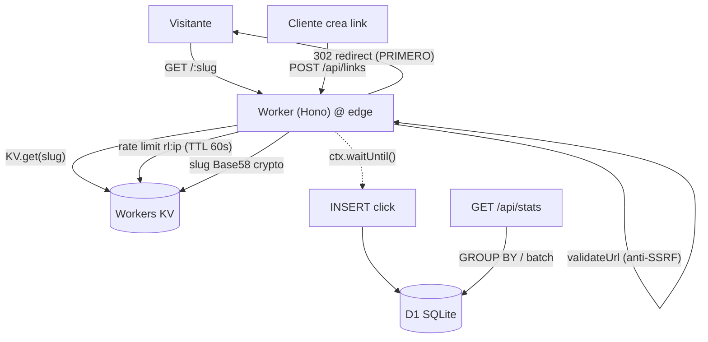

---

## 6. rest-api-jwt-auth

**Qué es.** Una API REST de nivel producción que demuestra autenticación segura con JWT sobre una arquitectura por capas limpia, incluyendo el detalle que muchos omiten: **revocación real de sesión con rotación de refresh tokens** persistidos. Es la pieza "fundamentos de backend" del portafolio.

**Stack.** TypeScript sobre **Node 20** · **Express 4** (app factory `createApp()`) · **Prisma 5 + PostgreSQL** · `jsonwebtoken` + `bcryptjs` (10 rounds) · **Zod** (validación de request y de entorno) · **Helmet** (con CSP a medida) + CORS · **Jest + Supertest** · Docker + Vercel (entrypoint serverless `api/index.ts`).

**Cómo funciona por dentro / conceptos que demuestra.**
- **Arquitectura por capas:** cada módulo sigue `routes → controller → service` (controllers delgados, lógica en services); todos los errores burbujean a un único `error.middleware.ts`.
- **JWT access + refresh con rotación:** access 15 min, refresh 7 días. En `refresh`, se verifica el token, se comprueba que existe en la tabla `refresh_tokens`, **se borra (revoca)** y se emite un par nuevo — rotación real. `logout` con `deleteMany` idempotente.
- **Revocación server-side:** los refresh tokens se persisten en BD → logout real y detección de tokens revocados.
- **Roles:** middleware `authorize(...roles)` sobre `authenticate`; enum `Role { USER, ADMIN }`.
- **Anti user-enumeration:** login devuelve el mismo `"Invalid credentials"` para email inexistente y contraseña incorrecta.
- **Fail-fast config:** `src/config/env.ts` valida el entorno con Zod al arrancar (`process.exit(1)` si falta algo).
- **DTO seguro:** `toPublicUser()` nunca expone el hash. Ops: `/health` + graceful shutdown.

**Características.** `POST /api/auth/register|login|refresh|logout`, `GET /api/users/me`, `GET /api/users` (solo ADMIN), `GET /health` · rotación/revocación de tokens · validación Zod + manejador de errores central · landing interactiva (`src/landing.ts`).

**Archivos clave.** `prisma/schema.prisma` (`User`, `RefreshToken`, enum `Role`), `src/utils/jwt.ts`, `src/modules/auth/*`, `src/middlewares/*`, `src/config/env.ts`, `api/index.ts`.

**Diagrama.**

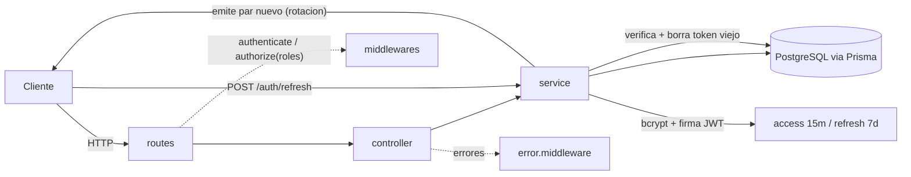

---

## 7. jwt-auth-dashboard

**Qué es.** La **misma autenticación del proyecto anterior, pero full-stack en Next.js**: registro, login, dashboard protegido y control de acceso por rol, con sesiones persistentes. Frontend + backend en un solo proyecto.

**Stack.** Next.js 16 (App Router + route handlers) · React 19 · TypeScript · **Prisma 6 + PostgreSQL (Neon)** · `jsonwebtoken` + `bcryptjs` + **Zod** · **Vercel + Neon**; Docker Compose local.

**Cómo funciona por dentro / conceptos que demuestra.**
- **Modelo de datos** (`prisma/schema.prisma`): `User` (email único, password hasheado, enum `Role USER/ADMIN`) y `RefreshToken` (relación con `onDelete: Cascade`, `expiresAt`).
- **Flujo de auth** (`src/lib/auth.ts` + `jwt.ts`): bcrypt (10 rounds), access token 15 min + refresh 7 días guardados en **cookies httpOnly** (`sameSite: lax`, `secure` en prod) — invisibles al JS del cliente para mitigar XSS.
- **Revocación server-side** (`persistRefreshToken`): el logout revoca en BD.
- **Guard en Server Components:** `getSession()` lee la cookie y verifica el JWT; `/dashboard` redirige si no hay sesión.
- **Autorización por rol:** `GET /api/users` es solo ADMIN (401 sin sesión, 403 sin permiso) y nunca expone hashes; el USER ve su perfil en `/api/users/me`.
- **Seguridad:** mismo error para email desconocido y password incorrecto (anti-enumeration); validación con Zod (`flatten()` para errores de campo).

**Características.** Landing pública · registro y login con validación real · dashboard protegido (guard en Server Component) · UI según rol (ADMIN ve todos los usuarios; USER ve su perfil) · logout con revocación server-side.

**Archivos clave.** `prisma/schema.prisma`, `src/lib/{auth,jwt,validation,env,prisma}.ts`, `src/app/api/auth/{register,login,logout}/route.ts`, `src/app/api/users/route.ts` (ADMIN), páginas `login/`, `register/`, `dashboard/`.

**Diagrama.**

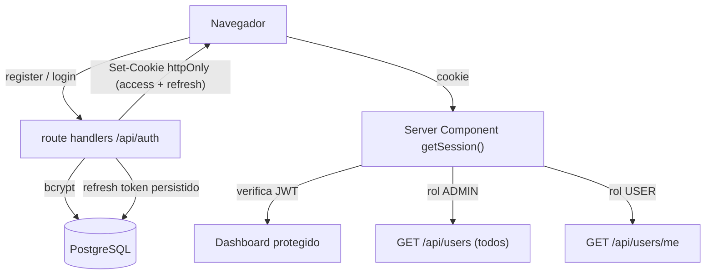

---

## 8. iot-mqtt-monitor

**Qué es.** Un panel de monitoreo industrial que recibe telemetría de máquinas de planta directamente en el navegador vía **MQTT**, sin backend intermedio. Simula una planta (prensa hidráulica, horno de temple, compresor) con sensores de temperatura, presión, vibración y consumo, con tendencias en vivo y alarmas por umbral.

**Stack.** Next.js 16 · React 19 · TypeScript · **`mqtt` (MQTT.js) v5** (cliente pub/sub en navegador y Node) · broker **HiveMQ público** (WSS `:8884/mqtt` para el navegador, TCP `:1883` para el simulador) · gráficos SVG a mano (sin librería de charting) · Docker + Vercel.

**Cómo funciona por dentro / conceptos que demuestra.**
- **Pub/sub desacoplado:** dispositivos publican, dashboards se suscriben; ninguno conoce al otro.
- **MQTT sobre WebSockets:** el navegador no puede abrir el socket TCP crudo, así que conecta por `wss://` al mismo broker.
- **Topics con wildcards:** una sola suscripción `northwind/plant-1/+/telemetry` cubre todas las máquinas.
- **QoS 0** (at-most-once) como decisión deliberada para telemetría de alta frecuencia (sin round-trips de ACK).
- **Contrato compartido** (`src/lib/telemetry.ts`): la interfaz `Reading` y `nextReading()` (random walk con reversión a la media y picos) las usan por igual el navegador y el simulador Node → no hay dos copias que diverjan.
- **Umbrales de alarma** (`ok`/`warn`/`crit`) con feed en tiempo real; manejo de estado de conexión y reconexión; **simulador in-browser** (activado por defecto) que publica cada 2 s.

**Características.** Barra de conexión en vivo · tarjeta por máquina con sparkline SVG y bandas warn/crit · feed de alarmas · simulador in-browser y simulador Node tipo PLC (`npm run simulator`) · test de ida y vuelta (`npm run verify`).

**Archivos clave.** `src/lib/telemetry.ts` (contrato + umbrales), `src/lib/mqtt-config.ts` (broker/topics/QoS), `src/components/MqttDashboard.tsx`, `src/components/Sparkline.tsx`, `scripts/simulator.ts`.

**Diagrama.**

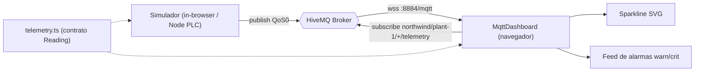

---

## 9. kpi-dashboard

**Qué es.** Un dashboard de business intelligence (ingresos, pedidos, clientes, ticket promedio de un retailer ficticio) con desgloses por categoría y región. Enfoque en visualización de datos y UX de dashboard — y con el detalle notable de que **todos los gráficos son SVG hechos a mano, sin librería de charting**.

**Stack.** Next.js 16 · React 19 · TypeScript · Tailwind v4 · **cero dependencias de runtime** más allá de Next/React · Vercel (sin BD ni variables de entorno).

**Cómo funciona por dentro / conceptos que demuestra.**
- **Datos sintéticos deterministas** (`src/lib/data.ts`): genera 24 meses de pedidos con un PRNG sembrado (**mulberry32**), con crecimiento ~4 %/mes, estacionalidad Q4 y compradores recurrentes. Sustituto estable de una BD real (memoizado con `getOrders()`).
- **Agregación tipo SQL** (`src/lib/metrics.ts`): KPIs, series mensuales y desgloses por categoría/región/producto (equivalente a `GROUP BY`/`SUM`), con deltas contra el período anterior y top-5.
- **Server Component + filtro por URL** (`src/app/page.tsx`): el período (6/12 meses) se lee de la URL y todo se recalcula server-side.
- **Interactividad** con pequeños client components (hover, tooltip, crosshair) sobre gráficos presentacionales.
- **Accesibilidad:** paleta validada para daltonismo (contraste ≥ 3:1); identidad por leyenda/etiqueta, no por color.

**Características.** 4 tiles KPI con delta y sparkline · área de ingresos con crosshair + tooltip · barras por categoría · donut por región · tabla de top productos · filtro de período server-side.

**Archivos clave.** `src/lib/data.ts` (mulberry32), `src/lib/metrics.ts`, `src/components/charts/{AreaChart,BarChart,DonutChart}.tsx`, `src/app/page.tsx`.

**Diagrama.**

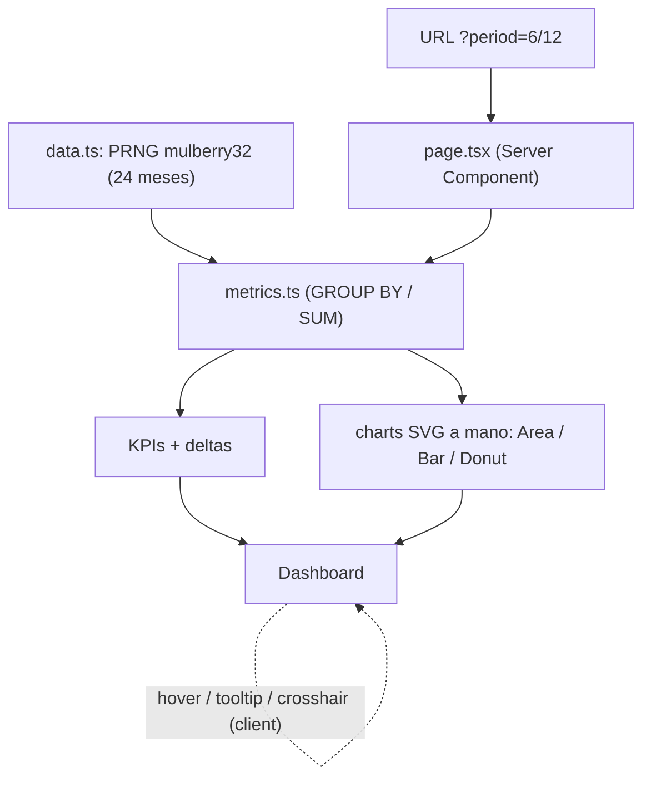

---

## 10. algorithms-visualizer

**Qué es.** Una herramienta educativa que implementa algoritmos y estructuras de datos **desde cero**, con **Big O medido en vez de citado**: cuenta las operaciones mientras el algoritmo corre y dibuja la curva de crecimiento. Cubre ordenamiento, complejidad, pathfinding y estructuras de datos, con **54 tests**.

**Stack.** Next.js 16 · React 19 · TypeScript · **Vitest** (testing) · visualizaciones SVG inline · Docker + GitHub Actions.

**Cómo funciona por dentro / conceptos que demuestra.**
- **Patrón central — cada sort es un generador** (`src/lib/sorting.ts`) que hace `yield` de operaciones (`compare`, `swap`, `overwrite`, `sorted`) en vez de devolver el arreglo. Ese único diseño alimenta a la vez el **visualizador** (anima) y el **benchmark** (cuenta) con el mismo código.
- **Algoritmos de orden:** bubble (con early-exit → O(n) en el mejor caso), insertion, selection, merge, quick (Lomuto), cada uno con metadatos best/avg/worst, espacio y estabilidad.
- **Benchmark** (`src/lib/benchmark.ts`): `measure()` cuenta operaciones; `referenceCurve()` escala las curvas teóricas `n`, `n log n`, `n²` al punto medido para comparar **forma**, no factor constante.
- **Estructuras desde cero** (`src/lib/structures.ts`): `Stack`, `Queue` (con puntero head para evitar el O(n) de `shift()`), `LinkedList`, `BinarySearchTree` (degenera a lista con entrada ordenada), `MinHeap` (array plano), `HashMap` (encadenamiento separado, hash FNV-1a, resize a factor de carga 0.75).
- **Pathfinding** (`src/lib/pathfinding.ts`): BFS, Dijkstra (usa el `MinHeap` como cola de prioridad) y A* (Dijkstra + heurística Manhattan admisible); A* abre menos celdas alcanzando el mismo costo óptimo.
- **Tests como invariantes:** verifican que al cuadruplicar `n` el conteo crece ~16× en O(n²), que bubble es O(n) en entrada ordenada, que el BST degenera, etc.

**Características (4 páginas).** Ordenamiento animado con contadores en vivo · Big O medido vs. curvas teóricas · BFS vs Dijkstra vs A* sobre la misma grid · estructuras de datos y el momento en que dejan de honrar su complejidad.

**Archivos clave.** `src/lib/{sorting,benchmark,structures,pathfinding}.ts` + sus `*.test.ts`, páginas `src/app/{page,complexity,pathfinding,structures}`, `SortVisualizer.tsx`, `PathfindingGrid.tsx`.

**Diagrama.**

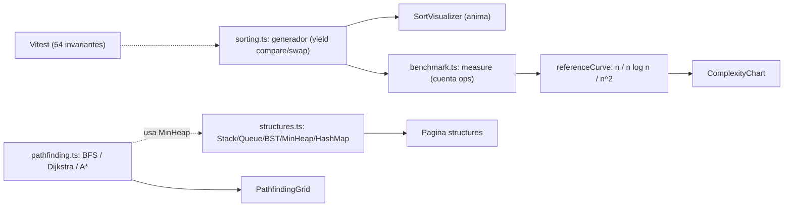

---

## 11. portfolio-index

**Qué es.** La landing que reúne el portafolio: presenta los proyectos en producción con su demo en vivo y su repositorio. Una única página HTML autocontenida, sin paso de build.

**Stack.** HTML + CSS + **JavaScript vanilla** (una sola `index.html`, sin framework ni dependencias de runtime; el único `node_modules` es Playwright, devDependency para las capturas) · **Vercel**.

**Cómo funciona por dentro.**
- **Sitio 100 % cliente:** el contenido se renderiza con JS desde un array `projects` en línea (`renderGrid()` / `renderFilters()`).
- **i18n EN/ES** (objeto `T`), **tema claro/oscuro** con variables CSS aplicadas inline en `<head>` para evitar flash, ambos persistidos en `localStorage` (inglés + claro por defecto).
- **Filtrado por categoría** (chips) sin recargar · imágenes `loading="lazy"` con `width/height` · `rel="noopener"` · responsive.

**Características.** Grid de tarjetas (categoría, badge Capstone, descripción bilingüe, tags, enlaces Demo/Código) · hero con avatar y métricas · selector de idioma y tema · sección DevOps que describe el pipeline de CI · footer con el stack de despliegue (capa gratuita).

**Archivos clave.** `index.html` (todo: estilos, i18n, tema, array de proyectos, render), `avatar`, `shots/<repo>.jpg` (miniaturas).

**Diagrama.**

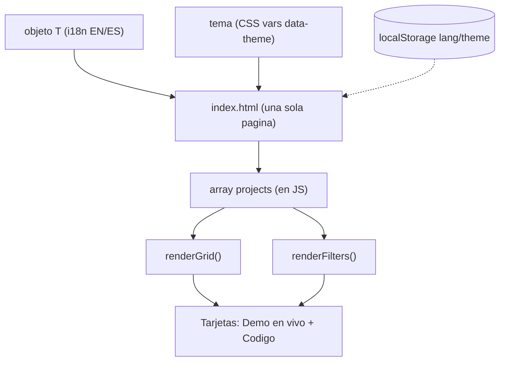

---

## Hilos conductores del portafolio

- **Cuatro motores de datos reales:** PostgreSQL (Prisma), MongoDB, Redis y Cloudflare D1/KV — cada uno elegido por la forma del problema, no por moda.
- **Concurrencia y correctitud:** transacción ACID que no sobrevende (northwind-ops), `INCR` atómico (nosql-catalog), rotación/revocación de tokens (los dos de auth).
- **Tiempo real:** SSE (northwind-ops) y MQTT/WebSockets (iot-mqtt-monitor).
- **IA aplicada bien hecha:** RAG con grounding y fuentes citadas (rag-chat-assistant) y asistentes fundamentados en datos reales (northwind-ops).
- **CI que verifica invariantes, no solo que compile:** dos proyectos levantan bases de datos reales en CI y el pipeline **falla si una caché deja de ser más rápida** o si una query de analítica cambia de resultado.
- **Cero infraestructura pagada:** todo en capas gratuitas (Vercel, Cloudflare, Neon, MongoDB Atlas, Upstash).
- **Producto cuidado:** los 11 con tema claro/oscuro e idioma EN/ES (inglés + claro por defecto).
